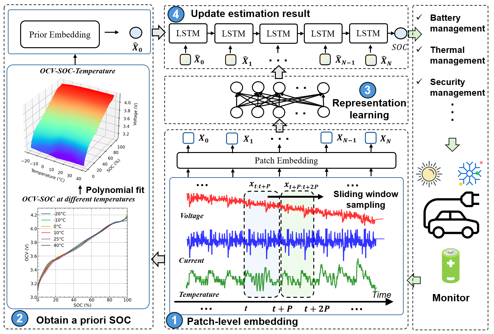

# Prior-based patch-level representation learning for electric vehicle battery state-of-charge estimation across a wide temperature scope

[Songtao Ye](https://scholar.google.com.hk/citations?user=fIXF4OwAAAAJ&hl=zh-CN), and [Dou An](https://scholar.google.com.hk/citations?user=pB7gIp8AAAAJ&hl=zh-CN&oi=ao)

Code for our paper that predicts power battery SOC at different temperatures. [[pdf]](https://www.sciengine.com/SCTS/doi/10.1007/s11431-024-2765-2;JSESSIONID=833aa97d-8aaa-4449-8cfc-c5ec8a5247d8)



-------------------------------

## 👌Usage

**Step 0: Download the datasets**

Download the [LG dataset](https://data.mendeley.com/datasets/cp3473x7xv/3) and put its content in the directory `dataset/LG-18650HG2/`

**Step 1: Get the SOC-OCV curves at different temperatures** (Already exists in the folder)

```python
run preprocessing/get_SOCOCV.ipynb
```

**Step 2: Fitting the OCV-SOC-Temperature relationship** (Already exists in the folder)

```
run preprocessing/get_SOCOCV.ipynb
```

**Step 3: Train the model and use **

```
python train.py
```

## ✉️Contact

For any question, you can contact [songtaoye9@gmail.com](mailto:songtaoye9@gmail.com)

## 👍Citation

If you use this code, please cite:

```
@article{ye2024priorsoc,
        title={Prior-based patch-level representation learning for electric vehicle battery state-of-charge estimation across a wide temperature scope}, 
        author={Ye, Songtao and An, Dou},  
        journal={SCIENCE CHINA Technological Sciences},  
        year={2024},
        doi={https://doi.org/10.1007/s11431-024-2765-2}
}
```

## References

**[data-driven-modelling-of-li-ion-batteries](https://github.com/raghuramshankar/data-driven-modelling-of-li-ion-batteries)**

**[battery-state-estimation](https://github.com/KeiLongW/battery-state-estimation)**